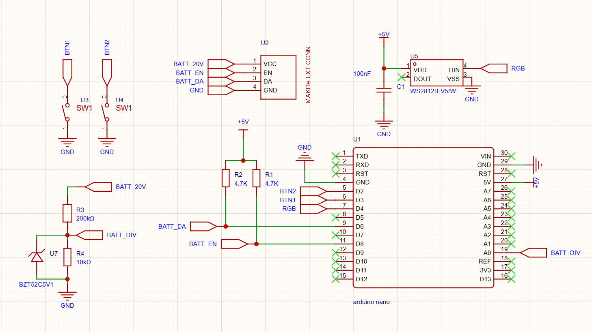
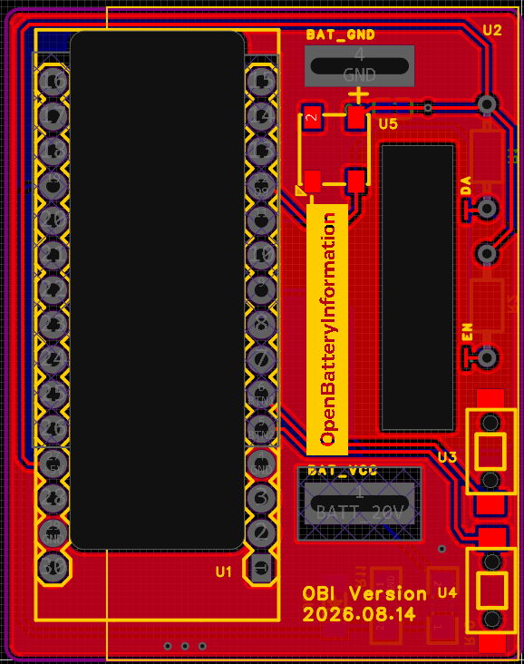
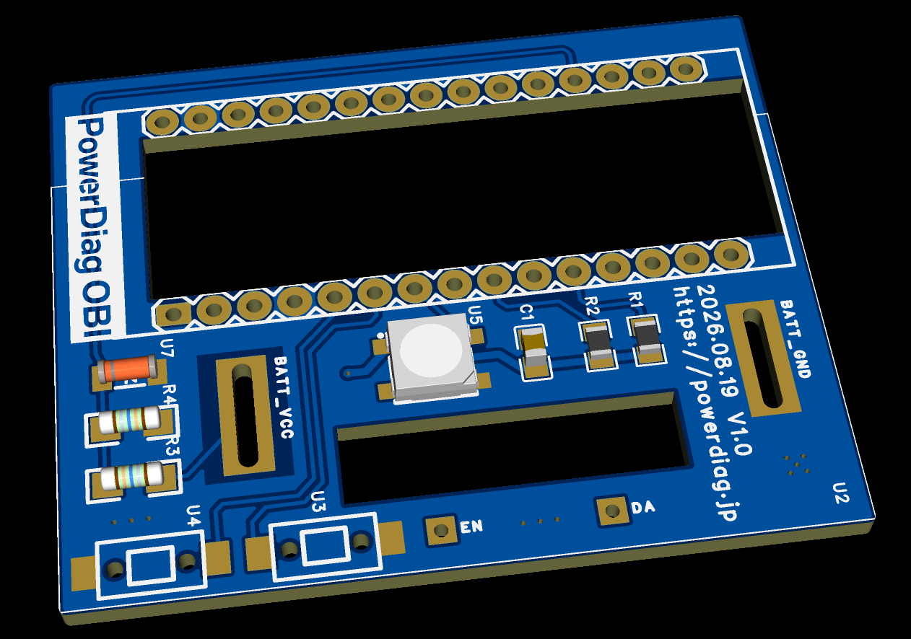
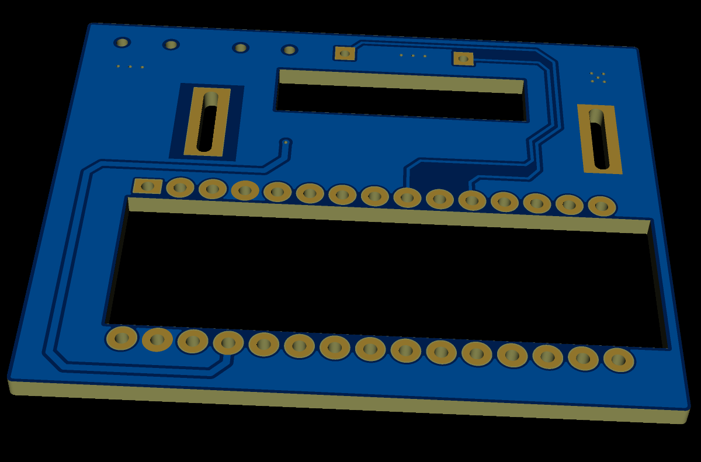

# PowerDiag OBI — Interface Board

**PowerDiag OBI** is a dedicated hardware interface board (OBI Version 2026.08.14) built around an
**Arduino Nano**, together with the firmware that drives it. It is a fork of
[Open Battery Information](https://github.com/mnh-jansson/open-battery-information).

On top of the original 1-Wire interface it adds an RGB status indicator, two front-panel buttons and
live battery voltage measurement, so the board can be used stand-alone as well as from the PC software.

> **Relation to the upstream project**
> The PC side is a browser app under `web/`, so there is nothing to install: open the page, pick the
> board, read the pack. It replaces the Python/Tkinter application, whose protocol handling it is a
> direct port of — the last Python version lives on in upstream's `v0.2.3` tag.
> For the original firmware documentation and project history see
> **https://github.com/mnh-jansson/open-battery-information**



---

## Features

### 1. WS2812 RGB status indicator (U5)

A single WS2812 in a 5050 package is used to show battery/tool state at a glance (idle, reading,
read OK, error, cleared, ...) without having to look at the PC.

* Data in (`DIN`) is driven from Arduino **D9**
* Powered from **+5V**, decoupled with **C4 (100 nF)**

### 2. Two push buttons (U3 / U4)

Both act on a **1 second hold**, never on a stray press:

* **BTN1 → D3** — read battery information. If the battery is already showing as locked, the same
  hold unlocks it (clears the error flags) and reads back the new state.
* **BTN2 → D2** — dismiss the result on the LED and return to the idle voltage display.

Both buttons switch the pin to **GND**, so they are active-low and are configured with
`INPUT_PULLUP` in firmware. No external pull-up resistors are fitted for the buttons.

### 3. Real-time battery voltage measurement (ADC)

The pack voltage (`BATT_20V`) is measured continuously through a resistor divider into **A0**:

* **R10 = 200 kΩ** (high side) / **R11 = 10 kΩ** (low side) → divider ratio **1:21**
* **U6 = BZT52C5V1** (5.1 V zener) clamps `BAT_DIV` to protect the ADC input

The ADC runs against the ATmega328P's **internal 1.1 V bandgap reference**, not against `AVCC`.
`AVCC` is only the USB rail minus a diode drop and moves with the port, the cable and the load,
while the bandgap does not move with the supply at all. `AREF` (U1 pin 18) is left unconnected on
the board, so nothing conflicts with it.

1.1 V across the 1:21 divider puts full scale at **23.1 V**, and a full 21 V pack at 91 % of the
range — the divider ratio is chosen for this reference:

| | Pack voltage | At A0 | ADC counts |
| --- | --- | --- | --- |
| Full scale | 23.1 V | 1.100 V | 1023 |
| Full 5S pack | 21.0 V | 1.000 V | 931 |
| Nominal 18 V pack | 18.0 V | 0.857 V | 798 |
| Resolution | **22.6 mV** | 1.07 mV | 1 |

Convert the raw reading back to pack voltage with:

```text
V_batt = (ADC / 1023) * 1.1 * 21 * VBAT_CALIBRATION
```

Anything above 23.1 V saturates the ADC and reads as 23.1 V rather than continuing to climb. That
is above a full LXT pack, and the zener still protects the input, but keep it in mind if you point
the board at a higher voltage source.

The measurement drives the idle colour of the status LED, and the PC application picks it up on
every read and shows it as **Terminal Voltage (measured)** next to the values the BMS reports.
It is fetched once per read, not polled.

**Load on the pack.** The divider is the only thing connected to `BATT_20V`, and it draws about
**100 µA** (21 V / 210 kΩ). The board can be left on a battery without meaningfully discharging it.

**What the zener is actually for.** In normal use U6 never conducts — a full pack only produces
1.0 V at A0, nowhere near the 5.1 V breakdown. It covers the fault case: if R11 goes open circuit
or is not fitted, A0 would otherwise see the full pack voltage, and U6 clamps it instead.

**Inserting a battery with the Nano unpowered is safe.** A0 sits about 0.6 V above the dead 5 V
rail, so the MCU's ESD clamp conducts, but R10 limits that current to the same ~100 µA — two orders
of magnitude below the ±1 mA injection limit. `BATT_20V` reaches nothing else on the board; the
Nano's `VIN` is not connected, the board is USB powered only.

#### Calibration

**The reading has to be calibrated per board.** The bandgap reference is stable against supply
changes, but its *absolute* value is only specified as **1.0 V to 1.2 V** — it is a per-chip
constant, so an uncalibrated board can read up to about 10 % off. Once trimmed it stays trimmed:
unlike an `AVCC` reference it does not need re-checking when you change USB port or cable.

Calibrate once, at compile time:

1. Insert a battery and measure its terminal voltage with a multimeter.
2. Read what the software reports as *Terminal Voltage (measured)*.
3. Set `VBAT_CALIBRATION` in [ArduinoOBI/src/main.cpp](ArduinoOBI/src/main.cpp) to
   `multimeter reading / reported reading`.
4. Rebuild and flash.

This is deliberately a compile-time constant — one number, set once per board. There is no runtime
calibration menu and nothing stored in EEPROM.

---

## Web app

The PC-side tool is a static web app in [`web/`](web/). It talks to the board over **Web Serial**, so
customers do not install anything — they open the page, pick the board once and read the pack.

    web/
      index.html            markup
      styles.css            styling
      icon.svg              app + tab icon
      manifest.webmanifest  PWA metadata, so it installs as a windowed app
      sw.js                 service worker, network first with an offline fallback
      js/transport.js       Web Serial framing (see the frame layout in ArduinoOBI/src/main.cpp)
      js/lxt.js             Makita LXT commands and parsing
      js/i18n.js            Japanese / English / Chinese strings
      js/app.js             UI

**Deploying:** copy the contents of `web/` to `powerdiag.jp/obi`. Every path in the app is relative,
so it runs from any sub-path without a build step. It must be served over **HTTPS** — Web Serial is
unavailable on plain HTTP.

**Running it locally:** `python -m http.server` inside `web/`, then open `http://localhost:8000`.
`localhost` counts as a secure context, so the serial port works without a certificate.

**Browser support:** desktop Chrome and Edge. Firefox and Safari do not implement Web Serial, and
neither does any mobile browser. Windows 10/11 ship with Edge, so customers need no extra download —
but the USB-serial driver (CH340 on most Nano boards) must be present, or the board simply will not
appear in the port picker.

---

## Battery connector (U2, Makita LXT)

| Pin | Net           | Description                            |
| --- | ------------- | -------------------------------------- |
| 1   | `BATT_20V`    | Pack positive, also fed to the divider  |
| 2   | `BAT_EN`      | Enable line                             |
| 3   | `BAT_ONEWIRE` | 1-Wire data line                        |
| 4   | `GND`         | Pack negative / ground                  |

`BAT_ONEWIRE` and `BAT_EN` are each pulled up to +5V with **4.7 kΩ** (R1 / R2).

## Pin assignment (Arduino Nano, U1)

| Arduino pin | Net           | Function                                          |
| ----------- | ------------- | ------------------------------------------------- |
| D2          | `BTN2`        | Button 2 — dismiss result (active low, hold 1 s)  |
| D3          | `BTN1`        | Button 1 — read / unlock (active low, hold 1 s)   |
| D6          | `BAT_ONEWIRE` | 1-Wire data, 4.7 kΩ pull-up to +5V                |
| D8          | `BAT_EN`      | Battery enable, 4.7 kΩ pull-up to +5V             |
| D9          | `DIN`         | WS2812 data                                       |
| A0          | `BAT_DIV`     | Battery voltage via 200 k / 10 k divider          |
| 5V / GND    | —             | Supply for WS2812 and pull-ups                    |

D6 and D8 keep the pin numbers used by the existing firmware (`ONEWIRE_PIN` / `ENABLE_PIN` in
`ArduinoOBI/src/main.cpp`), so the board is backwards compatible with the stock ArduinoOBI build and
the PC application keeps working unchanged.

Firmware support for the buttons, the WS2812 and the ADC is implemented in `ArduinoOBI` — see
[ArduinoOBI/README.md](ArduinoOBI/README.md#stand-alone-operation) for the LED colour codes.

> **Note for ESP builds:** if you use an ESP32-C3 instead of the Nano, the pull-ups must go to
> **3.3V, not 5V**, or the GPIOs will be damaged. The divider values still work, but the voltage
> conversion has to be redone for the 3.3 V / 12-bit ADC. See `ArduinoOBI/README.md`.

---

## Board

| Layout | Top | Bottom |
| ------ | --- | ------ |
|  |  |  |

The Arduino Nano sits in a socket on the top side; the buttons (U3/U4), the WS2812 (U5) and the
battery terminals (`BAT_VCC` / `BAT_GND`, plus the `EN` and `DA` pads) are on the same side.
The passive components — R1, R2, R10, R11, the zener U6 and C4 — are on the bottom side.

## Getting the board

**Buy a kit** — the PCB together with all the components is available as a kit on AliExpress.
Search for **`open battery information`**
([search](https://www.aliexpress.com/wholesale?SearchText=open+battery+information)).

**Or build it yourself** — the full schematic and PCB are in
[obi-interface-board/](obi-interface-board/) as an **EasyEDA Pro 3.0** project (`ProDoc_OBI.epro2`).
Import it into [EasyEDA Pro](https://pro.easyeda.com/) and order the board straight from
[JLCPCB](https://jlcpcb.com/), or export Gerbers and have it made anywhere else. Everything is
through-hole and hand-solderable. See [obi-interface-board/README.md](obi-interface-board/README.md).

## TODO

* **Enclosure** — 3D printable STL files for a case are being worked on and will be added here.

---

## Credits & license

This project builds on [Open Battery Information](https://github.com/mnh-jansson/open-battery-information)
by [mnh-jansson](https://github.com/mnh-jansson). The firmware is derived from that work, and the
protocol handling in `web/js/lxt.js` is a port of its `makita_lxt.py`; see the upstream repository for
the original README, documentation and project history.

The bundled 1-Wire library in `ArduinoOBI/lib/OneWire` is by Jim Studt, Paul Stoffregen and other
contributors, under the license stated in its own source headers.

Everything is MIT licensed — see [LICENSE.md](LICENSE.md), which carries both the original copyright
and ours.
